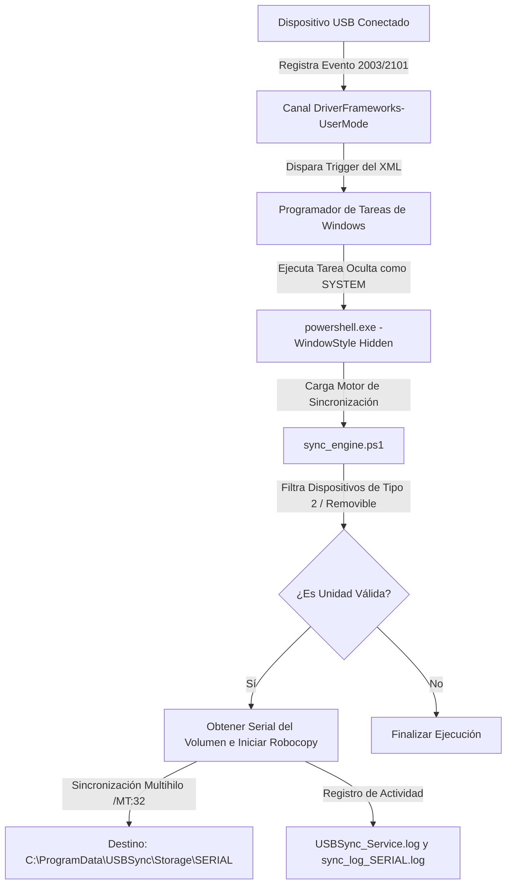

# 🛡️ USB Auto-Sync Service

> **Solución silenciosa, de alto rendimiento y orientada a eventos para la sincronización automatizada de dispositivos USB en Windows.**

---

[](LICENSE)
[](https://microsoft.com/windows)
[](https://github.com/PowerShell/PowerShell)

**USB Auto-Sync Service** es un motor de sincronización de datos diseñado para entornos corporativos y de administración de sistemas en Windows. Su propósito es detectar la inserción de unidades de almacenamiento masivo USB de manera instantánea y respaldar su contenido en un directorio local protegido, operando de manera invisible en el contexto de seguridad más alto (`SYSTEM`).

A diferencia de las soluciones tradicionales, **no utiliza polling continuo** (bucles de escaneo constantes), lo que reduce el consumo de CPU y memoria a **cero recursos** en estado de inactividad.

---

## ✨ Características Clave

*   **⚡ Arquitectura Orientada a Eventos:** Se activa instantáneamente mediante eventos del canal nativo `DriverFrameworks-UserMode` de Windows (Event ID 2003 y 2101).
*   **🚀 Copia Multihilo de Alto Rendimiento:** Utiliza `Robocopy` optimizado con `32 hilos` (`/MT:32`), reintentos inmediatos y modo backup (`/B`) para copiar incluso archivos protegidos por ACLs restrictivas.
*   **👤 Invisibilidad Total y Seguridad:** Corre bajo el contexto del sistema local `NT AUTHORITY\SYSTEM` de manera totalmente invisible en el espacio de usuario (sin ventanas flotantes, consolas ni notificaciones).
*   **📂 Almacenamiento Estructurado y Aislado:** Identifica y crea automáticamente directorios de destino basados en el número de serie de volumen del USB, previniendo sobreescrituras accidentales entre dispositivos.
*   **🔒 Mitigación de Concurrencia:** Registro de actividad segregado con logs individuales por número de serie (`sync_log_<Serial>.log`) y un registro global del servicio (`USBSync_Service.log`), lo cual previene bloqueos de escritura y pérdida de trazas cuando se conectan múltiples dispositivos simultáneamente.
*   **🛡️ Validación de Elevación Activa:** Los scripts de instalación y desinstalación ejecutan una verificación nativa de privilegios de Administrador para asegurar despliegues limpios y evitar errores parciales por falta de permisos.
*   **🛠️ Despliegue en Un Clic:** Scripts integrales de instalación y desinstalación que automatizan la copia de artefactos, el registro de la tarea oculta y la asignación de atributos de sistema.

---

## 🏗️ Arquitectura y Flujo de Trabajo

El siguiente diagrama detalla cómo interactúa el sistema operativo con los componentes del servicio al conectar un USB:



---

## 📁 Estructura del Repositorio

```text
Hide-Clone-USB/
│
├── 📜 README.md                 # Este documento de presentación.
├── 📘 USBSync_User_Manual.md    # Manual detallado de usuario, troubleshooting y mantenimiento.
├── ⚙️ sync_engine.ps1            # Motor lógico de detección y sincronización por Robocopy.
├── 🛠️ install.ps1               # Script de instalación automatizada de servicios y carpetas.
├── 🧹 uninstall.ps1             # Script de desinstalación limpia y remoción de tareas.
└── 📑 USB_Sync_Task.xml         # Plantilla XML para la importación del trigger de eventos.
```

---

## 🚀 Despliegue e Instalación Rápida

> [!IMPORTANT]
> Se requieren **Privilegios de Administrador** en PowerShell para poder interactuar con el Programador de Tareas y crear carpetas de sistema.

### Paso 1: Clonar e Ingresar al Directorio
Abre una terminal de PowerShell como Administrador y clona el repositorio:

```powershell
git clone https://github.com/bmontes93/Hide-Clone-USB.git
cd Hide-Clone-USB
```

### Paso 2: Ejecutar Instalador
Para desplegar el servicio de forma automática, ejecuta:

```powershell
.\install.ps1
```

**¿Qué hace el instalador?**
1. Crea el directorio de almacenamiento seguro en `C:\ProgramData\USBSync`.
2. Copia la suite de scripts al directorio seguro.
3. Importa y activa la tarea programada `Infrastructure\USBSyncService` en segundo plano.
4. Oculta el directorio de almacenamiento con atributos de sistema (`Hidden` y `System`).

---

## 📊 Monitoreo y Verificación

### Inspeccionar Estado de la Tarea
Puedes comprobar que la tarea esté registrada correctamente en Windows mediante:

```powershell
Get-ScheduledTask -TaskName "Infrastructure\USBSyncService"
```

### Monitorear Logs en Tiempo Real
El motor registra de forma exhaustiva eventos globales de servicio y transferencias individuales. Puedes visualizar la actividad en tiempo real usando:

```powershell
# Log global del ciclo de vida del servicio:
Get-Content -Path "C:\ProgramData\USBSync\USBSync_Service.log" -Wait -Tail 20

# Log de transferencia específico de un dispositivo USB (reemplaza <Serial> con el real):
Get-Content -Path "C:\ProgramData\USBSync\sync_log_<Serial>.log" -Wait -Tail 20
```

### Ubicación del Almacén Oculto
Los datos sincronizados de cada USB se organizan por su número de serie en la siguiente ruta:

```text
C:\ProgramData\USBSync\Storage\<Serial-Del-USB>\
```

---

## 🧹 Desinstalación Completa

Para retirar completamente el servicio, los triggers de eventos y limpiar todo rastro del almacenamiento del sistema, ejecuta el script de desinstalación:

```powershell
.\uninstall.ps1
```

Este proceso:
*   Detiene y elimina de forma definitiva la tarea programada `Infrastructure\USBSyncService`.
*   Elimina de forma segura la estructura oculta de `C:\ProgramData\USBSync`, liberando el almacenamiento consumido.

---

## 🔒 Consideraciones de Seguridad y Diseño

*   **Acceso Elevado (`/B`):** El servicio corre como `SYSTEM` y utiliza el flag de copia con privilegios de Backup de `Robocopy`. Esto permite resguardar información crítica ignorando restricciones de pertenencia de usuario (ACLs) del USB.
*   **Almacén Invisible:** El directorio `C:\ProgramData\USBSync` se marca intencionalmente como de Sistema y Oculto. No aparecerá en el Explorador de Archivos convencional a menos que se activen explícitamente los archivos protegidos del sistema.
*   **Ejecución Silenciosa:** Se configura con propiedades de proceso nativas del kernel para evitar el despliegue del host de consola (`conhost.exe`) del usuario activo, asegurando que no haya interrupción visual en la pantalla.

---

## 📄 Licencia

Este proyecto está bajo la Licencia MIT. Consulta el archivo de licencia para obtener más detalles.
